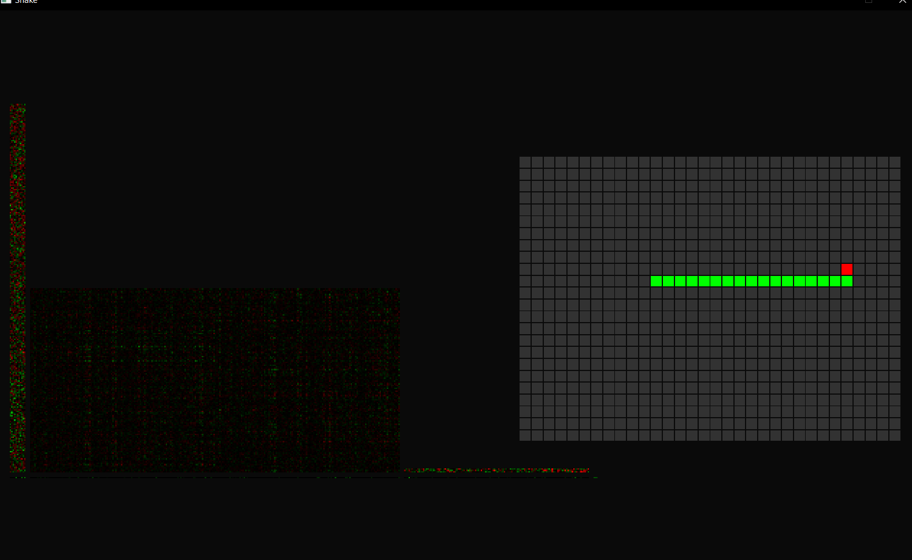

# SnakeAI

An artificial neural network using *Deep Q-learning* that can play the game Snake.

Developed in C++ from scratch.

[Stable Release v1.0.0](https://github.com/jiamingwangnet/SnakeAI/releases/tag/v1.0.0)